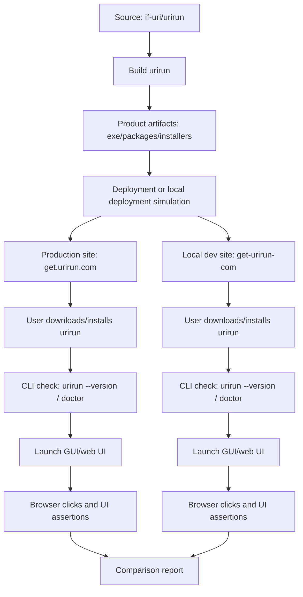
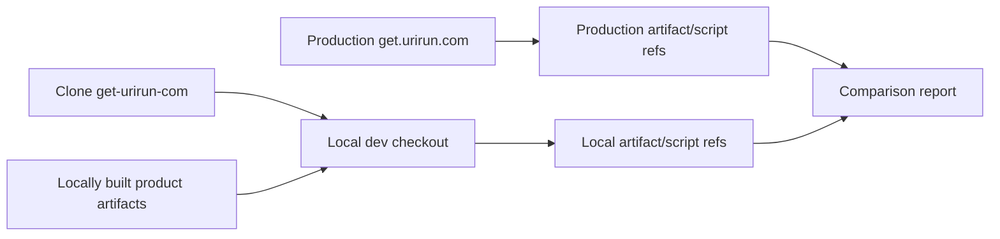
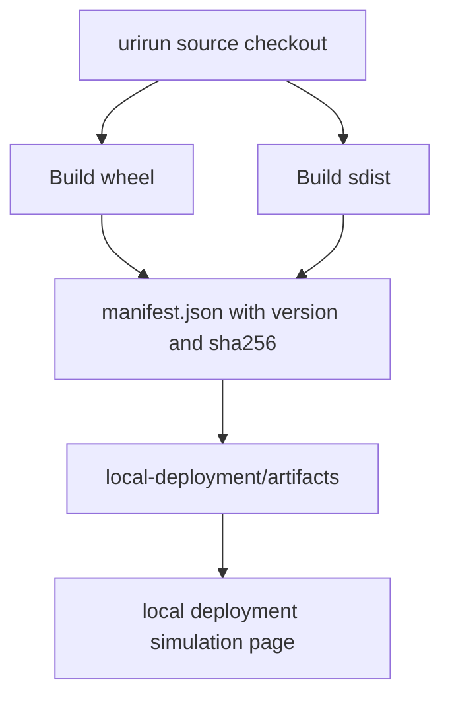

# Multiplatform E2E Design

This repository is the external black-box and end-user validation harness for
`urirun`. It does not replace developer tests in `if-uri/urirun`; it validates
that a selected `urirun` ref can be built, packaged, exposed through the install
site, installed by a user, launched as CLI, and exercised through the GUI.

## Goals

- Validate Linux, Windows and macOS behavior without pretending Windows/macOS
  are ordinary Docker targets.
- Test the installed product from the outside, using the same public surfaces a
  user sees.
- Keep product artifacts separate from diagnostic test artifacts.
- Report production, local development and deployment-simulation gaps honestly.

## Current Coverage

- CLI smoke tests: installation, `--version`, `doctor`, `run`, registry commands,
  connector commands, permissions and error handling.
- Transport smoke tests: HTTP, MCP and optional gRPC.
- Platform profiles: Linux Docker, Windows runner and macOS runner.
- Diagnostic reports: JSON reports, stdout/stderr logs and JUnit XML.

## New User Journey Coverage

- Browser test for `GET_URIRUN_PRODUCTION_URL`, default
  `https://get.urirun.com/`.
- Controlled installer flow from the public install site.
- Product artifact build and local deployment simulation.
- Optional comparison with a local checkout of
  `https://github.com/if-uri/get-urirun-com`.
- GUI/web UI test using `urirun host dashboard serve` and Playwright clicks.

## Test Types

| Type | Purpose | Location |
| --- | --- | --- |
| CLI tests | Verify installed command behavior | `tests/test_cli_*.py` |
| Transport tests | Verify HTTP/MCP/gRPC transport surfaces | `tests/test_transports.py` |
| Installer tests | Verify install site and install scripts | `tests/test_get_urirun_*.py` |
| GUI tests | Verify browser UI and user clicks | `tests/test_gui_user_journey.py` |
| Deployment tests | Verify local product artifact build/deployment simulation | `tests/test_product_artifacts_deployment.py` |
| Product artifact tests | Verify wheels/sdists/installers/manifests/checksums | `reports/product-artifacts/`, `reports/local-deployment/` |

## Full Flow



```text
urirun source
    |
    v
build/package
    |
    v
product artifacts (.exe/packages/installers)
    |
    +--> production get.urirun.com
    |
    +--> local dev get-urirun-com
             |
             v
      user install flow
             |
             v
      CLI + GUI validation
```

## Production vs Local Development Site



The production variant checks the live site and reports the product artifact or
installer references it exposes. The local-dev variant clones
`get-urirun-com`, attaches locally built product artifacts, and records what
must be wired into the real site-specific dev server.

## Product Artifact Flow



Product artifacts are files users may install or download: wheels, sdists,
installers, platform packages, `.exe` files, checksums and version manifests.

Diagnostic test artifacts are not product artifacts. They include screenshots,
Playwright traces, GUI logs, stdout/stderr, JSON reports and JUnit XML.

## Inputs

- `URIRUN_REPO_URL`, default `https://github.com/if-uri/urirun.git`
- `URIRUN_REF`, default `main`
- `URIRUN_SOURCE_DIR`, optional local source checkout
- `GET_URIRUN_PRODUCTION_URL`, default `https://get.urirun.com/`
- `GET_URIRUN_REPO_URL`, default `https://github.com/if-uri/get-urirun-com.git`
- `GET_URIRUN_REF`, default `main`
- `GET_URIRUN_SITE_MODE`: `production-site`, `local-dev-site`, or `both`
- `GET_URIRUN_INSTALL_MODE`: `site`, `local-repo`, or `skip`
- `GET_URIRUN_ALLOW_REMOTE_INSTALL`: `0` or `1`
- `URIRUN_ARTIFACTS_DIR`, optional product artifact directory
- `URIRUN_DEPLOYMENT_MODE`: `production`, `local-simulated`, or `skip`
- `URIRUN_GUI_E2E`: `0` or `1`

## Outputs

Product artifact outputs:

- `reports/product-artifacts/`
- `reports/local-deployment/artifacts/`
- `reports/local-deployment/artifacts/manifest.json`
- installer downloads under `reports/installer/`

Diagnostic test outputs:

- `reports/*.json`
- `reports/*.stdout.log`
- `reports/*.stderr.log`
- `reports/screenshots/`
- `reports/traces/`
- `reports/junit.xml`

## Stable

- Existing CLI, registry, permissions, connector and HTTP transport checks.
- Product artifact build for the Python wheel/sdist when the target source tree
  and build dependencies are available.
- Local deployment simulation from locally built artifacts.

## Experimental

- Live `get.urirun.com` browser checks, because production content can change.
- Local `get-urirun-com` comparison, because the site repository may need a
  project-specific dev server command.
- GUI clicks, because the dashboard UI is evolving.
- gRPC, because it depends on optional `grpcio`.

## Xfail / External Blockers

- Remote installer execution is `xfail` unless
  `GET_URIRUN_ALLOW_REMOTE_INSTALL=1`.
- Production deployment is `xfail` in this harness unless a trusted CI/CD job
  explicitly provides credentials and approval.
- Local `get-urirun-com` dev serving is reported as an integration point when
  the repository does not expose a generic static server contract.
